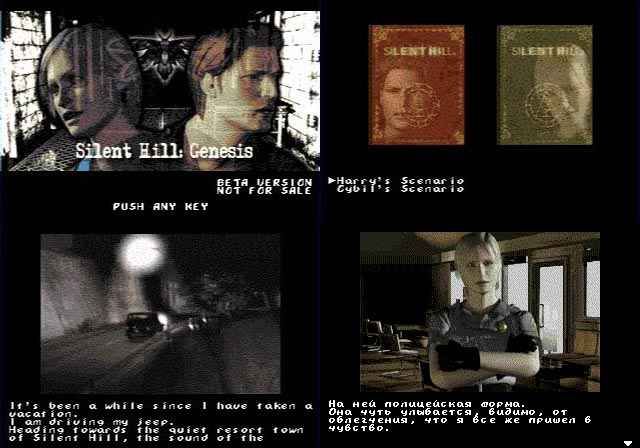

# Silent Hill Genesis

 

# <a href="#about">Об игре / About</a> # <a href="#versions">История версий / Changelog</a> # <a href="#downloads">Скачать / Downloads</a> # <a href="#links">Ссылки / Links</a> # 

<a name="about">

<b>About:</b> 
Silent Hill: Genesis свободная фанатская адаптация Silent Hill для Sega Megadrive/Genesis в формате визуальной новеллы на основе Silent Hill: Play novel вышедшей для GBA в 2001 году в Японии. 
 
Silent Hill: Genesis is an freeware fan-made adaptation of the original Silent Hill for Sega Megadrive/Genesis in the form of visual novel, based on Silent Hill: Play novel for GBA. 
A visual novel is an interactive fiction game featuring mostly static graphics with text. At certain moments the game asks a player to make a choice between two or more possible variants which affect the following walkthrough. 
Such kind of games is very popular in Japan, however totally unpopular in the west, therefore Silent Hill: Play Novel was never released outside this country. 
 
В игре 2 сценария: за Гарри и Сибил (сценарий Сибил доступен после прохождения игры за Гарри). 
После прохождения игры за Сибил вы получите пароль для просмотра коллекции цифровых карт (всего 32). 
 
The game offered two scenarios: for Harry and Cybil (available after completing Harry's Scenario). Besides the narration the game features a couple of puzzles and multiple endings. 
After reaching the end of Cybil scenario a player is awarded with Digital Cards - 32 in total. 
 
Игра находится на стадии открытого бета-тестирования. Обо всех ошибках, опечатках и неточностях прошу сообщать на email: bad_lupus[at]ua.fm 
 
This is not fully tested beta version. If you find some bugs or errors, please report me to email: bad_lupus[at]ua.fm 
 
<a name="versions">

<b>Changelog:</b> 
<u>06.11.2014 - Beta version</u> 
* Some code cleanups and new sounds in Harry's scenario. 
* Подчищен текст на пердмет е/ё, исправлено название улицы "ул. Левина", добавлено несколько новых звуков в сценарий Гарри. 
 
<u>23.10.2013 - Beta version</u> 
* Engine updates to GVS 1.82 with SFX support. Many code cleanups. Added some sound effects on first 5 Harry's chapters. Removed NEO Summer Retro Coding Contest 2013 badge. Also now you can download last english sources. 
* Движок обновлён до GVS 1.82 с поддержкой звука. Подчищен код. В первых пяти главах сценария Гарри есть некоторые звуковые эффекты. Удалено лого NEO Summer Retro Coding Contest 2013. Доступны для скачивания исходники последней английской версии. 
 
<u>12.07.2013 - Beta version</u> 
* Engine updates to GINCS VS 1.42. Many code cleanups. Added game end page animation. Added <a href="http://www.neoflash.com/" target="_blank">NEO Summer Retro Coding Contest 2013</a> badge. 
* Движок обновлён до GINCS VS 1.42. Подчищен код. Добавлена анимация текста в конце игры. Добавлено лого <a href="http://www.neoflash.com/" target="_blank">NEO Summer Retro Coding Contest 2013</a>. 
 
<u>02.07.2013 - Beta version</u> 
* Both scenarios with all puzzles and endings is ready. Added passwords for opening extra content. 
* Готовы оба сценария со всеми головоломками и концовками. Добавлена система паролей для доступа к дополнительному контенту. 
 
<u>03.06.2013 - Demo v0.80 *debug build*</u> 
* Both scenarios is ready. New font. Tilemaps optimisation for better compression. 
* Готовы обе сюжетные линии. В сценарии Сибил переведены пока только пролог и первая глава. Изменён шрифт. Оптимизирована графика для более оптимального построение тайловых карт и лучшего сжатия. 
 
<u>15.05.2013 - Demo v0.60 *debug build*</u> 
* Digital card collection completed. 
* Добавлена коллекция карт. 
 
<u>14.05.2013 - Demo v0.58 *debug build*</u> 
* Some script fixes (thx to James), font from prev. version, 2/3 minigames from Harry's scenario is ready. 
* Исправлены ошибки с установкой триггеров, влияющих на развилки сюжета. Возвращён предыдущий шрифт. Добавлена вторая головоломка. 
 
<u>22.04.2013 - Demo v0.56</u> 
* Text and gfx fixes, new font and some animation. 
* Новый шрифт, анимация света фар авто в одной из концовок. 100% перевод сценария Гарри. 
 
<u>20.04.2013 - bugfix</u> 
* Some text and gfx fixes 
* Исправления в тексте английской версии, добавлен пропущенный бэкграунд в 7 главе. 
 
<u>18.04.2013 - Demo v0.55</u> 
* Full Harry's scenario (18/18 chapters, 7/7 endings, 1/3 puzzles) 
* Полный перенос сценария Гарри (18/18 глав, 7/7 концовок, 1/3 мини-игр) 
 
<u>15.04.2013 - Demo v0.40</u> 
* 13/18 Harry's scenario chapters 
* 2/7 Harry'y endings  
* Some gfx is not optimised 
 
<u>14.04.2013 - Demo v0.25</u> 
* New GINCS engine with GFX compression (thx to Ti_ and 3DSchumacher) 
* 7/18 Harry's scenario chapters 
* Simpe minigame with boiler on chapter 5 
 
<a name="downloads">

<b>Downloads:</b> 
Lastest English Version: <a href="SHG_beta.7z">compiled rom</a> / <a href="SHG_beta_src.7z">src</a> 
Текущая русская версия: <a href="SHG_beta_ru.7z">ром</a> 
 
<a name="links">

<b>Links:</b> 
<a href="http://www.emu-land.net/forum/index.php/topic,65718.0.html" target="_blank">Тема по GINCS Studio на форуме emu-land.net</a> 
<a href="http://emulation.at.ua/publ/developing/sega_megadrive_genesis/gincs_studio/11-1-0-71" target="_blank">GINCS Studio homepage</a> 
<a href="https://www.youtube.com/watch?v=wuBXTupwiic&feature=c4-overview&list=UUfDPpLHN-7_6cctaU8CgPhQ" target="_blank">Русский обзор игры на youtube</a> 
<a href="http://www.romhacking.net/forum/index.php/topic,16287.0.html" target="_blank">Silent Hill: Genesis topic on RHDN Message board</a>

</body>
</html>
